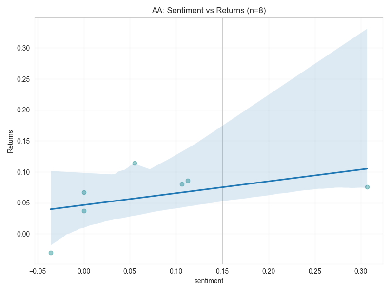

# 📈 Financial News Sentiment & Stock Price Prediction

## 1. Executive Summary
This project analyzes the correlation between financial news sentiment and stock market movements. Using a dataset of financial news headlines (FNSPID) and historical stock data from Yahoo Finance, we applied Natural Language Processing (NLP) and Technical Analysis (TA-Lib) to determine if news sentiment acts as a predictive signal for daily returns.

**Key Findings:**
*   **Strong Negative Correlation:** Stocks like **EWU** (-0.73) and **NFLX** (-0.38) showed that positive news often precedes a price drop in volatile tech/ETF sectors ("Buy the rumor, sell the news").
*   **Positive Correlation:** Stable industrial stocks like **AA** (Alcoa) and **KO** (Coca-Cola) showed moderate positive correlation (+0.47), indicating sentiment aligns with price action.
*   **Methodology:** We filtered the dataset to the **Top 20 most active stocks** to ensure statistical significance, analyzing over 5,000 headlines.

---

## 2. Methodology

### 🛠 Tools & Technologies
*   **Data Engineering:** `yfinance` for historical price extraction, `pandas` for time-series alignment.
*   **Technical Analysis:** `TA-Lib` for calculating SMA, RSI, and MACD indicators.
*   **Sentiment Analysis:** `TextBlob` to quantify headline polarity (-1 to +1).
*   **Visualization:** `Matplotlib` and `Seaborn` for automated plotting.

### 📊 Data Pipeline
1.  **Ingestion:** Loaded raw analyst ratings and filtered for the top 20 tickers by frequency.
2.  **Normalization:** Aligned news timestamps (UTC) with stock trading days (Local Time) by normalizing to `YYYY-MM-DD`.
3.  **Sentiment Scoring:** Aggregated average daily sentiment scores for days with multiple headlines.
4.  **Merging:** Inner-joined news data with stock daily returns (`Close_Price_Today / Close_Price_Yesterday - 1`).

---

## 3. Quantitative Analysis (Task 2)
We performed technical analysis on the top active stocks to visualize market trends.

**Indicators Used:**
*   **SMA (Simple Moving Average):** Used 20-day and 50-day windows to identify trend reversals.
*   **RSI (Relative Strength Index):** Monitored momentum to detect overbought (>70) or oversold (<30) conditions.
*   **MACD:** Analyzed signal line crossovers for momentum shifts.

*(Sample Chart from Analysis)*

*(Note: Charts available in `reports/figures_task2/`)*

---

## 4. Correlation Analysis (Task 3)
We calculated the Pearson correlation coefficient between daily sentiment scores and daily stock returns.

**Results:**
| Stock | Correlation | Interpretation |
|-------|-------------|----------------|
| **EWU** | **-0.73** | Strong Negative (Contrarian Signal) |
| **AA**  | **+0.47** | Moderate Positive |
| **KO**  | **+0.43** | Moderate Positive |
| **NFLX**| **-0.38** | Weak Negative |
| **MRK** | **+0.17** | Weak Positive |

**Visual Evidence:**

> **Insight:** The data suggests that sentiment is sector-dependent. Industrial/Consumer goods (AA, KO) react logically to news, while Tech/ETFs (NFLX, EWU) often show inverse reactions due to high volatility and speculative trading.

---

## 5. Conclusion & Recommendations
While simple sentiment analysis provides a weak signal for the broader market, it acts as a strong **contrarian indicator** for specific volatile assets.

**Recommendations for Nova Financial Solutions:**
1.  **Sector-Specific Strategy:** Use "Buy on Positive News" for industrial stocks, but use "Sentiment Divergence" (contrarian) strategies for Tech stocks.
2.  **Volume Threshold:** Only trade on signals where daily news volume exceeds 5 articles to reduce noise.
3.  **Real-Time Integration:** Upgrade from daily aggregation to minute-level data streams to capture immediate market reactions.

---
**Author:** Maireg
**Date:** November 2025